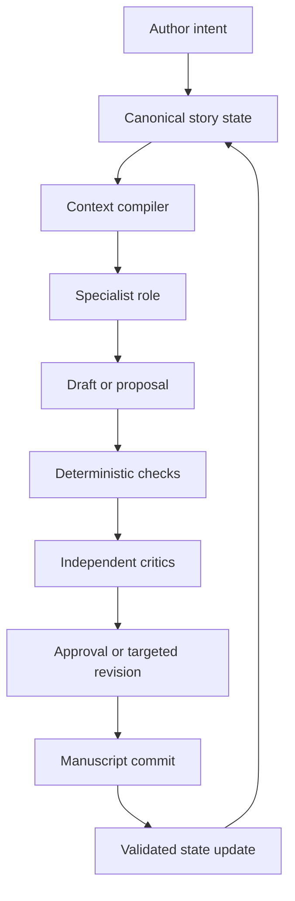
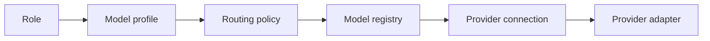

# Writer Harness — Detailed Architecture and Build Plan

## 1. Executive decision

Build a local-first, model-agnostic fiction-writing harness in Python. Its central design rule is:

> The manuscript is canonical for prose; structured story state is canonical for continuity.

The harness should not ask one model to remember, plan, draft, edit, and update memory in a single conversation. It should compile a small, purpose-built context packet for each task, run a dedicated role, validate the result, and commit only approved changes.

This directly addresses the observed MiMo weakness in scenes with more than two active characters. The solution is not simply a larger prompt. It is an explicit multi-character scene model containing presence, goals, knowledge, relationships, conversational turns, physical positions, and unresolved obligations. MiMo can then concentrate on prose rather than reconstructing all of that state implicitly.

The recommended initial setup is:

| Responsibility | Default model class | Reason |
| --- | --- | --- |
| Creative Director | strongest available model; MiMo-V2.5-Pro is the economical default | Makes high-impact story decisions infrequently |
| Story Architect | MiMo-V2.5-Pro | Handles book-wide structure and difficult revisions |
| Scene Planner | MiMo-V2.5 | Cheap enough for every scene; works from structured state |
| Character Intent Planner | MiMo-V2.5 | Produces compact intent cards, not prose |
| Draft Writer | MiMo-V2.5 | Main high-volume creative role |
| Developmental Editor | MiMo-V2.5-Pro or a strong non-MiMo model | Stronger reasoning and reduced correlated blind spots |
| Continuity/Character Critics | MiMo-V2.5 | Narrow, verifiable review jobs |
| Line Editor | MiMo-V2.5, escalating difficult chapters to Pro | High-volume but constrained editing |
| Final Book Reviewer | strongest independent model available | Used at milestones rather than every scene |

Every role must be configurable. No provider or model name belongs in orchestration code.

## 2. Product goals

The harness should:

1. Take a story from premise through outline, scenes, chapters, revision, and export.
2. Maintain reliable continuity across a full novel or series.
3. Write convincing scenes containing several distinct characters.
4. Separate creative drafting from editorial judgment.
5. preserve author intent, voice, and approved canon.
6. Make every model action inspectable, reversible, and reproducible.
7. Keep token use low through selective context compilation.
8. Support MiMo as the high-volume default while allowing stronger models only where they add material value.
9. Allow the user to approve story-shaping decisions without micromanaging routine work.
10. Make it easy to branch, compare, and restore alternate versions.
11. Make provider connection and role-model assignment a first-class user feature, supporting API credentials and official OAuth flows where providers permit them.

### Non-goals for the first release

- A general autonomous-agent framework.
- Fine-tuning or training a fiction model.
- Real-time collaborative editing by multiple human authors.
- A full Scrivener replacement.
- Automatic publication.
- Unsupervised rewriting of an entire book.

## 3. Core operating model

The harness is a compiler-like pipeline rather than a persistent free-form chat.



Four principles govern the pipeline:

### 3.1 Context is compiled, not accumulated

Even though MiMo supports very long context, the harness should not repeatedly send the entire book. Long context is a reserve for book-wide audits, not the default memory strategy. Each role receives the smallest complete packet needed for its decision.

### 3.2 Agents propose; the harness commits

Models may propose prose, canon changes, new facts, and state updates. They do not directly mutate canonical state. Schema validation, contradiction checks, confidence rules, and the workflow determine what is committed.

### 3.3 Editing is diagnosis before rewriting

An editor first returns an issue ledger tied to passages and story requirements. The rewrite stage receives only accepted issues. This prevents an editor from flattening voice or casually changing plot facts.

### 3.4 Canon is layered

Not every idea has equal authority. The system distinguishes author-locked canon, approved project canon, inferred manuscript facts, plans, and speculative suggestions.

## 4. System architecture

Use a modular monolith for the first production version. It provides clear boundaries without the deployment and debugging burden of microservices.

### 4.1 Main components

| Component | Responsibility |
| --- | --- |
| Project Service | Project creation, settings, manifests, schema versions |
| Story State Store | Canon, entities, relationships, timeline, scene state, unresolved threads |
| Manuscript Store | Scene and chapter text, revisions, snapshots, exports |
| Workflow Engine | Runs, retries, checkpoints, approvals, branching, cancellation |
| Context Compiler | Selects and formats the minimum evidence required by a role |
| Connection Manager | Provider accounts, API credentials, official OAuth sessions, scopes, refresh, and connection health |
| Model Registry | Provider model discovery, capability normalization, aliases, pricing, quotas, and availability |
| Model Gateway | Provider-neutral async interface, rate limits, retries, structured-output repair |
| Routing Service | Resolves role profiles to models, applies overrides, capability checks, budgets, and fallbacks |
| Role Runtime | Versioned role prompts, tool permissions, input/output contracts |
| Validation Engine | Schema, continuity, timeline, cast, POV, style, and regression checks |
| Retrieval Service | Hybrid lexical, metadata, graph, and embedding retrieval |
| Evaluation Service | Golden scenes, regression suites, quality and cost metrics |
| Interface | CLI first; local web interface after the workflow is stable |

### 4.2 Recommended technology choices

- Python 3.12+
- `pydantic` for versioned domain contracts
- `SQLAlchemy` async with SQLite initially and PostgreSQL compatibility retained
- `aiosqlite` for the local database
- `Alembic` for migrations
- `httpx` for provider clients
- `tenacity` for bounded retry policies
- `structlog` or standard structured logging
- `Typer` for the CLI
- `FastAPI` for the later local API/UI boundary
- `Jinja2` for versioned prompt templates
- `ruamel.yaml` only where human-edited YAML is necessary; JSON for machine contracts
- `rapidfuzz` and SQLite FTS5 for cheap retrieval before adding embeddings
- `pytest`, `pytest-asyncio`, and snapshot testing
- `orjson` for large structured artifacts where it provides a measurable benefit

Do not introduce a vector database in the MVP. SQLite metadata queries, FTS5, entity links, scene ranges, and deterministic selectors will cover most retrieval. Add embeddings only after retrieval evaluation demonstrates a gap.

### 4.3 Concurrency model

The runtime is async. Independent critics, character intent cards, and retrieval queries may run concurrently. Canon commits and manuscript commits are serialized per project using a project-level write lock and optimistic revision numbers.

Parallelism must never permit two tasks to silently update the same scene or entity version. Every run records its input revision and fails cleanly on a stale write.

## 5. Project structure

Each writing project should be portable and inspectable:

```text
project/
  project.yaml
  manuscript/
    scenes/
    chapters/
    exports/
  canon/
    premise.yaml
    world.yaml
    style.yaml
  plans/
    book.yaml
    acts/
    chapters/
    scenes/
  state/
    story.db
    snapshots/
  prompts/
    overrides/
  evaluations/
    golden_scenes/
    reports/
  runs/
    artifacts/
```

The database is the queryable operational store. Human-readable files are durable project inputs, review surfaces, and exports. The harness must provide commands to verify that the two representations agree.

## 6. Canonical story state

### 6.1 Authority levels

Every fact has one of these authority levels:

| Level | Meaning | May a model change it? |
| --- | --- | --- |
| `locked` | Explicitly fixed by the author | No |
| `approved` | Accepted into canon | Only through a reviewed change request |
| `draft` | Planned but not yet established in prose | Yes, within task scope |
| `inferred` | Extracted from manuscript with evidence | May be corrected |
| `speculative` | Brainstorming candidate | Freely replaceable |

Facts also store provenance: author instruction, source scene and text span, role run, timestamp, confidence, and superseded fact if applicable.

### 6.2 Required entities

- Series
- Book
- Act or part
- Chapter
- Scene
- Beat
- Character
- Faction
- Location
- Object or artefact
- Event
- Rule of the world
- Relationship
- Plot thread
- Promise/payoff
- Mystery and revelation
- Motif
- Style constraint

### 6.3 Character state

Each character needs more than a biography:

- Stable identity and voice traits
- Values, fears, needs, desires, wounds, false beliefs
- Long-term arc and current arc phase
- Current explicit goal
- Current concealed goal
- Knowledge ledger: knows, suspects, falsely believes, must not know
- Relationship edges with direction-specific attitude and trust
- Current physical condition, possessions, and location
- Commitments, lies, debts, promises, and secrets
- Speech tendencies and prohibited caricatures
- Recent emotional trajectory
- Last meaningful appearance
- Unresolved business with other characters

Character voice examples must be short, curated excerpts rather than a growing dump of every line they have spoken.

### 6.4 Timeline and causality

Events store earliest start, actual start, duration, participants, location, causes, effects, and evidence. The validator should detect:

- Impossible travel
- Overlapping presence
- Age/date contradictions
- Knowledge obtained before its source event
- Injury, inventory, or relationship changes that disappear
- Effects appearing before causes
- Scene order inconsistent with chapter order

### 6.5 Plot threads and promises

Each thread stores introduction, escalation beats, expected resolution window, current status, participating entities, reader knowledge, character knowledge, and whether it is intentionally unresolved.

Promises/payoffs should be first-class records. This makes it possible to distinguish a deliberate mystery from a dropped subplot.

## 7. `state.skill` and long-term memory

`state.skill` should be an operational interface over current workflow state. It does not replace long-term story memory.

### 7.1 What `state.skill` owns

- Current task and phase
- Active project, book, chapter, and scene
- Current branch and revision
- Approved plan for the active job
- Completed and pending workflow steps
- Temporary decisions and assumptions
- Blockers, retry state, and escalation reason
- Exact artifacts produced by the current run
- Context budget and model routing decisions

### 7.2 What long-term memory owns

- Canonical world and character facts
- Timeline and causality
- Relationship history
- Plot promises and resolutions
- Style and voice decisions
- Author preferences that apply across the project
- Provenance-linked scene summaries
- Accepted editorial decisions

### 7.3 Memory layers

| Layer | Lifetime | Contents |
| --- | --- | --- |
| Run scratchpad | One role call | Working material; never canonical |
| Workflow state | One task | `state.skill` data and artifacts |
| Scene state | Until superseded | Cast, setting, goals, beat outcomes |
| Book memory | Full book | Canon, arcs, timeline, themes, promises |
| Series memory | Across books | Stable canon and prior-book outcomes |
| Author profile | Across projects, opt-in | Preferences and process defaults |

### 7.4 Memory write policy

After prose is accepted, a dedicated extractor proposes atomic state changes. A validator compares them with the scene plan, manuscript, and current canon. High-confidence non-conflicting observations can be committed automatically when the project policy allows it. New named canon, retcons, deaths, relationship phase changes, world rules, and timeline corrections require explicit approval.

Summaries never overwrite source facts. They are regenerable projections with the source revision recorded.

## 8. The multi-character scene system

This is the most important fiction-specific subsystem.

### 8.1 Why ordinary prompting fails

In a crowded scene, the model must simultaneously track who is present, where they are, what each person wants, what each knows, who heard each statement, who should respond, how voices differ, and what the scene must accomplish. Prose generation competes with state tracking. More context can worsen the problem by burying the active constraints.

The harness should externalize these constraints into a compact scene state and validate the prose against it.

### 8.2 Active cast tiers

Each scene classifies characters as:

- `focus`: POV and one to three principal scene participants
- `active`: materially acts, speaks, observes, or changes the outcome
- `ambient`: present but not individually simulated unless promoted
- `offstage`: relevant to discussion or motivation but absent

The draft writer receives full intent cards only for focus and active characters. Ambient characters receive a compact group description. This prevents a banquet hall from creating fifty agent contexts.

### 8.3 Character intent cards

Before drafting, the harness produces a compact card for each focus or active character:

- Public objective in this scene
- Private objective
- Starting emotional state
- What they know and do not know
- What they want from each other active character
- What they will volunteer, conceal, or lie about
- Tactics they are likely to use
- Boundary they will not cross yet
- Desired end state
- Voice anchors
- Required action or reaction

These cards are proposals derived from canon and the scene plan. The scene planner resolves conflicts between them before prose generation.

### 8.4 Interaction matrix

For three or more active characters, compile a directional interaction matrix. Each cell records the current relationship pressure and the specific business between the pair in this scene. Only non-empty edges enter the writer packet.

This is more useful than supplying long individual biographies because it encodes what matters between characters now.

### 8.5 Beat participation ledger

Every beat defines:

- Initiator
- Target or audience
- Characters able to observe it
- Intended surface effect
- Hidden effect
- Required reactions
- State changes caused by the beat
- Whether the beat advances plot, character, relationship, theme, or multiple dimensions

The writer may vary wording and micro-actions but must preserve the causal outcome unless it explicitly returns a change request.

### 8.6 Dialogue turn and presence checks

The validator tracks:

- Long stretches where an active character vanishes without narrative reason
- Characters responding to information they did not witness
- Unnaturally even round-robin dialogue
- Repeated speaker order
- Voice convergence
- Missing reactions to personally significant revelations
- Dialogue that services exposition but no character objective
- Characters who speak but never affect the scene

These are warnings with evidence, not automatic failures. Silence may be deliberate.

### 8.7 Scene complexity routing

Calculate a deterministic complexity score from active cast count, number of relationship edges, secrets in play, required revelations, action concurrency, timeline sensitivity, and POV difficulty.

Suggested routing:

| Complexity | Workflow |
| --- | --- |
| Low | Planner → writer → standard checks |
| Medium | Intent cards → planner → writer → character critic |
| High | Intent cards → interaction matrix → beat ledger → writer → parallel character/continuity critics → targeted rewrite |
| Critical | Creative Director approves scene strategy before drafting; strongest writer/reviewer route |

The score routes effort; it must not claim to measure literary quality.

## 9. Context compiler

The context compiler is the harness's main token-efficiency mechanism.

### 9.1 Context packet order

Use stable, cache-friendly ordering:

1. Role contract and non-negotiable rules
2. Task and output schema
3. Author-locked requirements
4. Project and book identity
5. Scene plan and beat ledger
6. POV and active cast state
7. Relevant relationships, knowledge, and timeline facts
8. Recent manuscript window
9. Retrieved earlier evidence
10. Style exemplars
11. Explicit exclusions and known risks

Stable prompt prefixes should be separated from volatile scene data so providers can benefit from prompt caching where supported.

### 9.2 Retrieval strategy

Retrieval should combine:

- Direct entity and relationship links
- Timeline overlap and causal dependencies
- Plot-thread membership
- Chapter/scene proximity
- Exact term and alias search
- Full-text relevance
- Later, optional semantic similarity

The compiler must log why every retrieved item was included. It also rejects duplicate summaries, stale revisions, low-authority speculation presented as canon, and facts outside the role's need-to-know scope.

### 9.3 Budgeting

Allocate budgets by section, not just a single maximum. If the packet is too large, trim in this order:

1. Remove duplicate prose excerpts.
2. Replace older prose with evidence-linked summaries.
3. Remove low-relevance style examples.
4. Compress offstage entities.
5. Escalate rather than remove locked constraints or active-character knowledge.

The harness should measure input tokens, output tokens, latency, retries, and cost per accepted thousand manuscript words.

## 10. Role architecture

### 10.1 Creative Front Door

This is the user's main conversational role. It converts requests into proposals, identifies whether a decision changes canon, and selects the correct workflow. It may brainstorm freely but cannot silently approve its own major story changes.

### 10.2 Scout

A read-only role or deterministic retrieval mode that locates the smallest relevant context. It returns references and relevance reasons, not creative decisions. It should usually run before book-wide planning, difficult continuity questions, or revision of old scenes.

### 10.3 Creative Director

Owns premise, tone, theme, major arcs, structural trade-offs, and resolution of conflicting editorial recommendations. It is invoked for high-impact decisions, not routine scene writing.

### 10.4 Story Architect

Transforms approved direction into book, act, chapter, scene, and beat plans. It must identify setup/payoff obligations, arc movement, pacing purpose, and dependencies.

### 10.5 Scene Planner

Builds the scene contract and multi-character structures. It does not write polished prose. Its output is compact and machine-validatable.

### 10.6 Draft Writer

Produces the scene from an approved packet. It can request a plan deviation but cannot quietly invent a conflicting fact. It should return prose separately from proposed deviations or state changes.

### 10.7 Character Critics

Each critic examines only one or a small group of characters. It checks agency, voice, knowledge, emotional continuity, relationships, and required reactions. For efficiency, run these only for medium/high-complexity scenes or flagged characters.

### 10.8 Continuity Critic

Checks manuscript claims against structured state and nearby prose. It reports contradictions with evidence and confidence. It never rewrites prose.

### 10.9 Developmental Editor

Assesses scene function, causality, tension, pacing, characterization, exposition, and payoff movement. It produces a ranked issue ledger with expected benefit, risk, and proposed scope.

### 10.10 Line Editor

Works only after structural approval. It improves clarity, rhythm, repetition, dialogue mechanics, and sentence-level voice while preserving facts and scene outcomes.

### 10.11 Rewrite Worker

Applies an accepted issue set. It receives the original text, immutable spans if any, issue IDs, and allowed scope. It must return a replacement plus a change map.

### 10.12 Independent Reviewer

Reviews the result without seeing the writer's hidden work or self-critique. It receives the task contract, relevant evidence, and final artifact. A different model family is preferred for book milestones when available.

## 11. Writer/editor separation

The writer and editor must be separate runs with separate role instructions and no shared conversational transcript.

### 11.1 Draft contract

The writer returns:

- Manuscript text
- Beat completion map
- Proposed intentional deviations
- New-fact candidates
- Uncertainties or blocked constraints

The prose remains clean; metadata is stored as a separate artifact.

### 11.2 Editorial issue ledger

Every issue contains:

- Stable issue ID
- Severity
- Type
- Evidence span
- Violated requirement or literary concern
- Explanation of reader impact
- Recommended action
- Scope of required change
- Confidence
- Risk of the proposed fix

Editors must distinguish errors from preferences. Low-confidence taste suggestions do not automatically enter a rewrite.

### 11.3 Revision policy

- Critical continuity and locked-canon violations block acceptance.
- High-severity structural issues require approval or revision.
- Medium issues may be batched.
- Style suggestions are opt-in according to the project's editing profile.
- Rewrites operate on the smallest coherent span.
- Full-scene regeneration is a last resort.
- After any rewrite, rerun only invalidated checks plus a final regression pass.

### 11.4 Anti-flattening protections

- Maintain an author-approved style profile and negative style rules.
- Compare lexical and rhythmic signals before and after editing.
- Require editors to cite a concrete benefit for each change.
- Keep distinctive fragments unless they cause a named problem.
- Use curated voice exemplars from approved prose.
- Track repeated editor tendencies such as shortening, smoothing, or removing ambiguity.

## 12. End-to-end workflows

### 12.1 New project

1. Capture premise, genre, audience, tone, desired length, themes, boundaries, and comparable works.
2. Separate locked requirements from exploratory ideas.
3. Generate several premise/structure options.
4. Run a creative review and record the user's chosen direction.
5. Build initial world, protagonist, conflict, and promise records.
6. Create a coarse book spine without over-planning every scene.
7. Establish a short style profile and a deliberately provisional voice sample.

### 12.2 Book planning

1. Creative Director produces or revises the book thesis and emotional promise.
2. Story Architect builds act-level progression.
3. Check causality, escalation, arc coverage, subplot capacity, and payoff timing.
4. Expand only the next planning horizon into chapters and scenes.
5. Keep distant plans lower-authority so discoveries in drafting can reshape them.

### 12.3 Scene drafting

1. Load active workflow state.
2. Scout relevant canon and manuscript evidence.
3. Compute scene complexity.
4. Generate intent cards when required.
5. Compile scene contract, interaction matrix, and beat ledger.
6. Run deterministic preflight checks.
7. Draft the scene.
8. Validate output shape and beat coverage.
9. Run deterministic continuity checks.
10. Run routed character, continuity, and developmental critics.
11. Present major issues or automatically revise within approved policy.
12. Run targeted rewrite.
13. Compare changes and rerun invalidated checks.
14. Accept manuscript revision.
15. Extract and validate state deltas.
16. Commit state and create a checkpoint.

### 12.4 Chapter revision

1. Freeze the current chapter revision.
2. Build a chapter-level tension, POV, timeline, and promise map.
3. Run developmental review without rewriting.
4. Approve an issue set and order it by dependency.
5. Apply structural changes before line edits.
6. Revalidate scene transitions and state deltas.
7. Run line editing and proof checks.
8. Compare chapter metrics and perform a fresh-reader review.

### 12.5 Book-wide review

Use long context selectively here. Run separate passes for structure, character arcs, continuity, pacing, world rules, promises/payoffs, theme, and prose consistency. Do not ask one reviewer to optimize everything in one response.

## 13. Workflow engine and run records

Every run should record:

- Run and parent-run IDs
- Project, branch, and input revision
- Role and prompt version
- Model/provider and generation settings
- Context manifest with source revisions
- Requested output schema
- Raw response and parsed artifact
- Retries and repair attempts
- Validation results
- Token, cost, and latency data
- Human decisions
- Resulting manuscript/state commits

### 13.1 Run states

`queued → compiling → running → validating → awaiting_approval → revising → accepted | rejected | failed | cancelled`

Runs are resumable from the last valid artifact. Provider failures must not force the user to repeat completed planning or reviews.

### 13.2 Retry rules

- Retry transient network and rate-limit errors with bounded exponential backoff.
- Repair invalid structured output once with a minimal schema-only prompt.
- If repair fails, retry the role with a different structured-output strategy.
- Never retry a creative call indefinitely.
- Never treat a different answer from a retry as equivalent without validation.
- Escalate repeated failures with the complete artifact trail.

## 14. Provider connections, model profiles, gateway, and routing

The provider layer must make adding an account and changing a role's model routine configuration work. Provider identity, authentication, model identity, role assignment, and routing policy are separate concepts.



A role binds to a named model profile, never directly to a provider model ID. The profile declares the type of model the role needs and its preferred candidates. The router resolves it against configured connections, current capability, quota, health, cost, and project policy.

### 14.1 Configuration entities

#### Provider definition

Describes integration behavior without containing user credentials:

- Stable provider type
- Display name
- Adapter/protocol family
- API base URL rules
- Supported authentication methods
- OAuth authorization, token, device-code, and revocation endpoints where officially supported
- Permitted OAuth scopes
- Model discovery method
- Capability and error normalization
- Provider-specific request options

#### Provider connection

Represents one configured account or endpoint:

- Stable connection ID and user-defined name
- Provider type
- Authentication method: `oauth`, `api_key`, `bearer_token`, `local`, or `none`
- Credential reference, never the credential itself
- Account/tenant metadata when returned by the provider
- Base URL override for compatible or self-hosted endpoints
- Connection health and last successful test
- OAuth expiry, granted scopes, and refresh status
- Optional budget, quota-window, and privacy restrictions
- Enabled/disabled state

The same provider may have several connections, such as a subscription-backed connection, a metered API account, and a local endpoint.

#### Model record

Represents a model exposed by a connection:

- Connection ID and exact provider model ID
- Friendly name and aliases
- Text, image, audio, tool, streaming, and structured-output capabilities
- Context and output limits
- Supported sampling parameters
- Known schema/tool restrictions
- Price or subscription quota metadata when available
- Health, latency, and recent failure observations
- Discovery source and last refresh time

Provider-reported metadata must be distinguishable from local overrides and observed behavior.

#### Model profile

Represents a reusable workload requirement and preference list:

- Stable profile name, such as `high_volume_writer`, `story_architect`, `fast_critic`, or `independent_deep_review`
- Required and preferred capabilities
- Ordered model candidates or policy-selected candidates
- Default generation settings
- Maximum context, latency, and cost policy
- Quota reserve rules
- Fallback permissions
- Independence requirements, such as excluding the draft writer's model family from final review

#### Role binding

Maps a role to a model profile and optional role-specific settings. Bindings are layered in this order:

1. Harness defaults
2. User defaults
3. Project overrides
4. Workflow overrides
5. One-run override

The most specific valid setting wins. Every run stores the fully resolved model, connection, settings, and reason for selection.

### 14.2 Authentication architecture

Support official OAuth where the provider explicitly offers a third-party authorization flow suitable for the harness. Otherwise use provider API credentials or a local unauthenticated endpoint. Do not scrape browser sessions, copy private application credentials, or assume that a consumer subscription automatically grants API access.

#### OAuth requirements

- Authorization Code with PKCE for browser-based desktop login where supported
- Device Authorization Grant where supported and useful for headless use
- Random `state` value and strict redirect validation
- Loopback redirect server bound only to localhost for desktop flows
- Minimum required scopes with scopes shown before authorization
- Secure refresh-token handling and automatic refresh before expiry
- Clear reauthentication state when refresh is rejected
- Provider logout/revocation when officially available
- Cancellation and timeout without leaving a half-created connection
- No access or refresh token in project files, logs, run artifacts, crash reports, or shell history

OAuth capability belongs in each adapter because endpoints, scopes, audience rules, token exchange, and account metadata differ between providers.

#### API credential requirements

- Accept credentials interactively, through an environment-variable reference, or from an existing secret-store entry
- Store secrets in the operating-system credential store through Python `keyring` where available
- Permit an explicit environment-only mode for servers and containers
- Never copy secrets into `project.yaml`
- Display only connection name, credential source, suffix/fingerprint where safe, scopes, and status
- Test credentials with the cheapest non-generating endpoint available; require confirmation before a billable generation test
- Support credential rotation without changing role or model bindings

#### Local providers

OpenAI-compatible and other supported local endpoints should be configurable with base URL, optional credential, discovery behavior, and manual model records. A local connection follows the same gateway contract as a hosted provider.

### 14.3 Adapter strategy

Implement a small adapter SDK rather than scattering provider conditionals through the application. Each adapter supplies:

- Authentication methods and connection lifecycle
- Model discovery and normalization
- Request translation
- Streaming event normalization
- Token usage and cost extraction
- Provider error classification
- Capability probes
- Cancellation behavior
- Optional quota/usage retrieval

Start with protocol-family adapters to maximize coverage:

1. OpenAI-compatible API
2. Anthropic-compatible API
3. Provider-specific adapters only when authentication, capabilities, or wire behavior requires them
4. Local/self-hosted adapter configuration built on the same families

Additional adapters should be loadable through Python entry points, with an explicit compatibility version. Third-party adapters receive only the credential reference and scoped connection operations they require; they must not receive unrestricted access to all stored credentials.

### 14.4 Model discovery and catalogue

When a provider offers model discovery, the registry should synchronize it on connection, on request, and on a configurable schedule. When discovery is absent or incomplete, permit manually declared models and local capability overrides.

Synchronization must not silently overwrite user aliases, tested capability overrides, generation presets, or role bindings. Removed provider models become unavailable but remain visible in historical run records.

The model browser should allow filtering by:

- Connected provider/account
- Capability
- Context size
- Structured-output and tool support
- Cost or subscription quota
- Observed latency and reliability
- Role compatibility
- Privacy/location restrictions

### 14.5 Easy model switching

Changing a model should be possible at four scopes:

- **Profile:** replace the default model for every role using that profile.
- **Role:** bind one role to a different profile or candidate order.
- **Project:** use a different routing set for one book.
- **Run:** test one model without persisting the change.

Changes take effect on the next role run and do not require an application restart. In-progress runs retain their resolved model for reproducibility unless explicitly cancelled and restarted.

Before accepting a binding, perform a capability preflight. For example, a model without the required context, multimodal input, or reliable structured-output mode cannot be assigned silently. The UI may offer a compatible profile adjustment, but the user must approve any loss of required capability.

### 14.6 Routing inputs

- Role and selected model profile
- Explicit user/project/run override
- Task complexity
- Context size
- Need for structured output
- Need for tools or multimodal input
- Cost ceiling
- Latency preference
- Current subscription/API quota and reserved capacity
- Provider connection and model health
- Project privacy policy
- Previous failed attempts
- Reviewer independence rules

Subscription quotas and rolling usage limits are configuration data, not hard-coded assumptions. The router should support the user's high-volume MiMo allowance while reserving scarcer Pro and premium-model capacity for architecture, escalation, and milestone review.

### 14.7 Fallback behavior

Fallbacks must be explicit and role-aware:

- A transient failure retries the same resolved model according to policy.
- Exhausted quota or sustained provider failure may advance to the next compatible candidate if the profile permits it.
- A fallback must satisfy all required capabilities and project privacy constraints.
- The run record identifies the intended and actual model and why fallback occurred.
- No silent fallback from a deep-review model to the draft writer when independence is required.
- No silent fallback to a more expensive billing source above the configured threshold.
- Creative retries and provider fallbacks preserve prior artifacts for comparison.

### 14.8 Recommended initial profiles

| Profile | Preferred use | Initial routing policy |
| --- | --- | --- |
| `creative_direction` | Premise, theme, major arcs | MiMo-V2.5-Pro; strongest available model for critical milestones |
| `story_architecture` | Book/chapter structure | MiMo-V2.5-Pro with premium escalation |
| `high_volume_writer` | Scene prose | MiMo-V2.5 |
| `scene_planning` | Intent cards and beat ledgers | MiMo-V2.5 |
| `fast_critic` | Narrow continuity/character checks | MiMo-V2.5 or configured fast reviewer |
| `developmental_editor` | Structural diagnosis | MiMo-V2.5-Pro or configured deep reviewer |
| `line_editor` | Sentence-level revision | MiMo-V2.5 with Pro escalation |
| `independent_deep_review` | Chapter/book milestones | Strong non-writer model family when connected |

MiMo-V2.5 remains the recommended high-volume model and Pro the economical escalation model, but these are default bindings rather than architectural dependencies. MiMo's official materials advertise a one-million-token context and long-horizon/agentic capabilities; the harness should still remain efficient at ordinary context sizes. See the [MiMo-V2.5 model card](https://huggingface.co/XiaomiMiMo/MiMo-V2.5) and [MiMo-V2.5-Pro model card](https://huggingface.co/XiaomiMiMo/MiMo-V2.5-Pro).

### 14.9 Structured-output hardening

Provider adapters should expose the simplest schemas possible. Avoid deeply nested discriminated unions in model-facing tools. Validate locally, tolerate harmless formatting variation, and separate creative prose from JSON metadata so one malformed object does not lose the manuscript output.

### 14.10 Connection and routing acceptance criteria

- Add a supported provider through OAuth or API credential without editing a project file.
- Configure several accounts for the same provider.
- Discover or manually register their models.
- Bind a role to a named profile from the CLI or UI.
- Change a profile's model and use it on the next run without restarting.
- Test a candidate model against a role's capability contract before saving.
- Refresh OAuth tokens without interrupting an active run.
- Rotate an API key without changing bindings.
- Record exact provider, connection, model, settings, and fallback reason for every run.
- Prevent secrets from appearing in project exports, logs, or run artifacts.

## 15. Tool and command surface

Keep the first interface small and task-oriented.

### Project and state

- `writer project create`
- `writer project status`
- `writer state show`
- `writer state verify`
- `writer checkpoint create`
- `writer branch create`
- `writer diff`

### Planning and writing

- `writer brainstorm`
- `writer plan book`
- `writer plan chapter`
- `writer plan scene`
- `writer draft scene`
- `writer continue`

### Review and revision

- `writer review scene`
- `writer review chapter`
- `writer review book`
- `writer issues list`
- `writer revise --issues ...`
- `writer accept`
- `writer reject`

### Memory and canon

- `writer canon query`
- `writer canon propose`
- `writer canon approve`
- `writer timeline show`
- `writer character show`
- `writer threads show`

### Operations

- `writer run show`
- `writer run resume`
- `writer providers list`
- `writer providers connect`
- `writer providers login`
- `writer providers status`
- `writer providers logout`
- `writer models sync`
- `writer models list`
- `writer models test`
- `writer profiles list`
- `writer profiles set`
- `writer roles bind`
- `writer roles resolve`
- `writer eval run`
- `writer export`

The later web interface should expose the same application services rather than duplicating business logic.

## 16. Quality gates

### 16.1 Deterministic gates

- Valid schemas and references
- No modification of locked canon
- All required scene participants accounted for
- Timeline and location feasibility
- Knowledge provenance
- Inventory and physical-state consistency
- Required beat coverage
- POV and tense policy
- No unresolved merge conflicts or stale revisions

### 16.2 Model-assisted gates

- Character agency and voice
- Emotional causality
- Dialogue subtext
- Scene tension and turn
- Exposition naturalness
- Pacing
- Setup/payoff effectiveness
- Prose quality and style adherence

Model-assisted gates should produce evidence and confidence, not a single opaque score.

### 16.3 Acceptance policy

A scene may be accepted when deterministic blockers pass, required beats are satisfied or intentionally changed, no unreviewed canon delta remains, and critical editorial issues are resolved or explicitly waived.

## 17. Evaluation strategy

Build evaluation into the MVP rather than adding it after prompts proliferate.

### 17.1 Golden scenario suite

Create small synthetic and project-derived cases for:

- Two-character intimate dialogue
- Three-character secret imbalance
- Five-character council scene
- Crowded scene with ambient characters
- Concurrent action and dialogue
- Character with a deliberate silence
- Revelation heard by only part of the cast
- Unreliable POV
- Timeline trap
- Object/injury continuity
- Distinctive voices under conflict
- Intentional canon change request

### 17.2 Metrics

- Locked-canon violation rate
- Knowledge leakage rate
- Missing required reaction rate
- Beat completion accuracy
- Character voice identification accuracy
- Contradictions per 10,000 words
- Accepted editorial issues per scene
- Percentage of edits later reverted
- Token cost per accepted 1,000 words
- Median time to accepted scene
- Structured-output failure rate
- Human preference win rate against a simple one-prompt baseline

### 17.3 Baselines

Compare the full harness against:

1. One large prompt with all relevant context.
2. Planner plus writer only.
3. Full pipeline without the interaction matrix.
4. Full pipeline with and without independent editing.

This will show which complexity is earning its cost.

## 18. Safety, control, and recoverability

- Version every manuscript and canon commit.
- Never overwrite an accepted scene without a new revision.
- Keep automatic edits inside explicit project policy.
- Show diffs before major rewrites.
- Require approval for locked/approved canon changes, major character outcomes, structural deletions, and retcons.
- Scrub secrets from logs and provider error payloads.
- Allow per-project provider/privacy restrictions.
- Support export to Markdown and DOCX without proprietary lock-in.
- Make deleted branches recoverable until the user explicitly purges them.

## 19. Observability

Use structured logs with run IDs and no hidden prompt contents at normal log level. Provide an inspectable run view showing context sources, role prompt version, model choice, validation failures, approvals, and costs.

Important dashboards or reports:

- Cost and tokens by role
- Acceptance and rewrite rate by model
- Most common continuity failures
- Retrieval items used versus later judged unnecessary
- Prompt/schema failure rate
- Character-specific issue trends
- Editor suggestion acceptance and reversion rates

## 20. Implementation roadmap

### Phase 0 — Evaluation spike

**Goal:** prove the multi-character packet before building the full application.

Build:

- A hand-authored scene state schema
- Intent cards
- Interaction matrix
- Beat ledger
- One MiMo writer prompt
- One continuity/character review prompt
- Ten golden scenarios
- Baseline comparison script

Exit criteria:

- The structured method materially beats the one-prompt baseline on knowledge leakage, missing reactions, and character distinction.
- Added token cost is measured and acceptable.
- The user prefers the prose at least as often as the baseline.

### Phase 1 — Core domain and storage

**Goal:** create reliable project, manuscript, and story-state foundations.

Build:

- Pydantic domain models and schema versioning
- SQLite async repositories
- Project and branch revisions
- Canon authority and provenance
- Characters, relationships, timeline, scenes, beats, and threads
- Transactional commits and snapshots
- Import/export for human-readable project files

Exit criteria:

- State round-trips without loss.
- Stale writes are rejected.
- Locked facts cannot be mutated without a change request.
- A project can be exported and recreated.

### Phase 2 — Model gateway and role runtime

**Goal:** run reliable, inspectable model tasks.

Build:

- Connection manager supporting API credentials, official OAuth, refresh, logout, and secure secret references
- Async protocol-family/provider adapters for the first configured providers
- Capability-based model registry with discovery, manual models, aliases, and health observations
- Named model profiles and layered role bindings
- Capability preflight, quota-aware routing, and explicit fallback chains
- Timeouts, cancellation, retries, and rate limiting
- Role and prompt versioning
- Structured-output parsing and bounded repair
- Run artifact recording
- Cost/token estimation

Exit criteria:

- The same role can switch providers through configuration.
- Providers can be connected without storing secrets in project files.
- OAuth refresh and API-key rotation do not require rebinding roles.
- Model/profile changes take effect on the next run without restart.
- Failed runs resume safely.
- Every output is traceable to exact inputs and prompt version.

### Phase 3 — Context compiler and retrieval

**Goal:** provide small, complete, explainable context packets.

Build:

- Deterministic entity, relationship, timeline, and thread selectors
- FTS5 manuscript retrieval
- Context manifests and section budgets
- Evidence deduplication and stale-summary rejection
- Token measurement
- Read-only scout role

Exit criteria:

- Every included item has a reason.
- Locked facts and active-character knowledge are never trimmed.
- Retrieval tests cover known relevant and distracting material.

### Phase 4 — Scene pipeline

**Goal:** draft and accept scenes end to end.

Build:

- Scene complexity routing
- Intent card generation
- Interaction matrix and beat ledger
- Writer contract
- Deterministic preflight and post-draft checks
- Character and continuity critics
- State-delta extraction and validation
- Checkpoint creation

Exit criteria:

- Three-to-five-character golden scenes pass agreed continuity thresholds.
- Re-running from a checkpoint is reproducible at the artifact level.
- No model directly writes canonical state.

### Phase 5 — Writer/editor workflow

**Goal:** revise without flattening voice or losing canon.

Build:

- Developmental issue ledger
- Issue approval/waiver flow
- Targeted rewrite worker
- Line editor
- Change maps and diffs
- Invalidated-check selection
- Anti-flattening metrics and voice exemplars

Exit criteria:

- Editors diagnose before rewriting.
- Every change maps to an accepted issue.
- Structural and line-edit passes remain separate.
- Regression checks catch introduced contradictions.

### Phase 6 — Chapter/book planning and review

**Goal:** support long-form progression.

Build:

- Book, act, chapter, and rolling-horizon planning
- Arc and promise/payoff views
- Chapter transition review
- Book-wide specialist audits
- Long-context review mode
- Independent milestone reviewer routing

Exit criteria:

- The harness can identify dropped promises, arc gaps, timeline conflicts, and pacing clusters across a complete test manuscript.

### Phase 7 — User interface and polish

**Goal:** make the harness pleasant for regular writing.

Build:

- Local FastAPI service
- Web UI for manuscript, scene packet, issues, canon, timeline, and diffs
- Streaming run progress and cancellation
- Approval inbox
- Cost controls and model profiles
- Markdown and DOCX export

Exit criteria:

- Normal use no longer requires direct database or configuration editing.
- All major decisions and automatic actions are visible and reversible.

## 21. Recommended MVP boundary

The first useful release should stop after Phase 5 and support one book, one active human author, text-only models, Markdown export, and scenes of up to six individually tracked active characters. It should include branching and checkpoints but not collaborative editing, a vector database, series-wide inference, or an elaborate visual UI.

The MVP proves the core claim: structured scene state plus independent editorial passes lets an economical model produce more reliable long-form fiction than a large undifferentiated prompt.

## 22. Build order for the first four weeks

### Week 1

- Define golden multi-character scenarios.
- Finalize `CharacterState`, `SceneContract`, `IntentCard`, `InteractionEdge`, `Beat`, and `StateDelta` schemas.
- Run the baseline and structured prompt experiment with MiMo-V2.5.
- Lock initial evaluation metrics.

### Week 2

- Implement project, manuscript, canon, and run repositories.
- Add revision guards, snapshots, and provenance.
- Implement the provider-neutral model gateway and MiMo adapter.
- Store complete run artifacts.

### Week 3

- Implement the context compiler and deterministic selectors.
- Add scene complexity routing.
- Implement planner, writer, and state-extractor roles.
- Run the complete draft-to-state loop.

### Week 4

- Add continuity and character critics.
- Add the editorial issue ledger and targeted rewrites.
- Run regression evaluation against the baseline.
- Review failure patterns and decide whether embeddings or additional roles are justified.

## 23. Decisions to lock now

1. Use Python and a modular monolith.
2. Make MiMo-V2.5 the default high-volume model and Pro the escalation model.
3. Bind roles to named model profiles and keep all provider/model selection configurable.
4. Support secure API credentials and official OAuth where the provider permits third-party authorization; never depend on scraped subscription sessions.
5. Treat manuscript prose and structured continuity state as separate canonical domains.
6. Treat `state.skill` as workflow memory, not long-term story memory.
7. Make multi-character intent cards, interaction edges, and beat participation first-class.
8. Separate diagnosis, approval, and rewriting.
9. Use deterministic validation wherever a fact can be checked mechanically.
10. Start with SQLite/FTS5 and defer embeddings until measured retrieval failures justify them.
11. Build the evaluation spike before the full application.

## 24. Definition of done

The harness is successful when it can take an approved scene plan, compile the correct state for a complex cast, produce a scene, identify concrete continuity and character failures, revise only the affected passages, update story state with provenance, and restore or branch any result—while using MiMo for most of the token-heavy work and reserving expensive models for decisions where they measurably improve outcomes.
